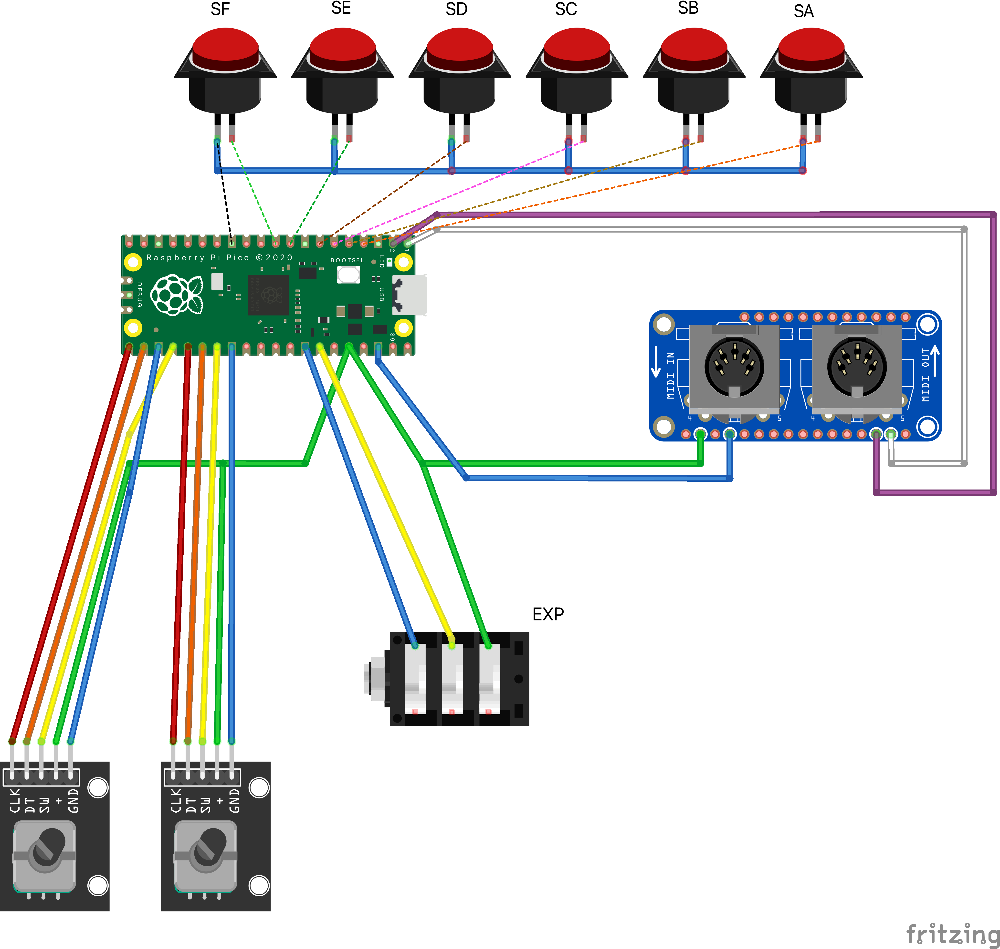

# Pedalboard Midi Adapter

This project implements a MIDI adapter for my pedalboard

The midi devices are daisy chained with MIDI cables in the following order:

```
XSONIC XTONE => this MIDI Adapter => Plethora X3 => RC500
```

The XTONE case is used to host the hardware.

## Hardware

The target hardware is a Adafruit [MIDI Feather Wing](https://www.adafruit.com/product/4740) on top of an Adafruit
[Feather RP2040](https://www.adafruit.com/product/4884)

### Wiring 



## Development
This project was generated with the [RP2040 Project Teamplate](https://github.com/rp-rs/rp2040-project-template)

### Dependencies

```
curl --proto '=https' --tlsv1.2 -sSf https://sh.rustup.rs | sh
rustup target add thumbv6m-none-eabi
cargo install flip-link
sudo apt-get install libudev-dev
cargo install elf2uf2-rs
```


## Deploment (Linux Host)

The firmware supports No-Button-Boot (nbb) bootsel mode via USB serial interface.

1. Connect USB C cable to Feather
4. Run `make deploy`
5. Remove USB C cable from Feater
