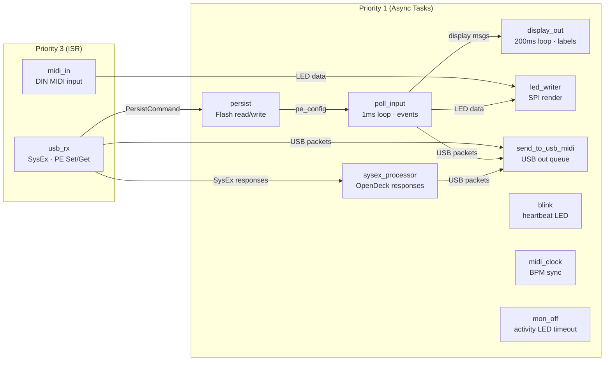
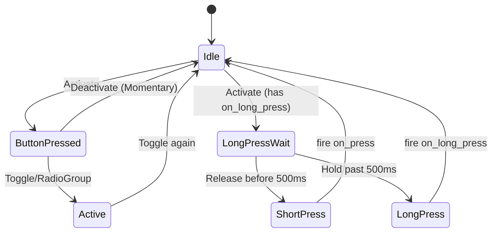

# Firmware Architecture

## RTIC Task Structure

The firmware uses RTIC v2 with async tasks on the RP2040. Dispatcher: `SW0_IRQ`.

| Task | Priority | Type | Purpose |
|------|----------|------|---------|
| `usb_rx` | 3 | ISR (`USBCTRL_IRQ`) | USB MIDI packet receive, SysEx reassembly, PE dispatch |
| `midi_in` | 1 (default) | ISR (`UART0_IRQ`) | DIN MIDI input, LED triggers, DIN→USB thru |
| `poll_input` | 1 | async | Button/encoder/expression polling (5ms), MIDI out, preset switching |
| `persist` | 1 | async | Flash config store + EEPROM state, load-on-boot, save-on-change |
| `sysex_processor` | 1 | async | Serialise OpenDeck SysEx responses → USB out |
| `send_to_usb_midi` | 1 | async | USB MIDI TX queue drain |
| `display_out` | 1 | async | OLED rendering (performance view, overlays) |
| `led_out` | 1 | async | LED ring/single rendering, 50Hz tick loop via PIO |
| `midi_clock` | 1 | async | BPM-driven MIDI Clock (0xF8) to DIN + USB |
| `blink` | 1 | async | Debug heartbeat LED (500ms) |

Inter-task communication uses `rtic_sync::channel` (bounded, lock-free).

## Task Dependency Graph



## PeHandler State Machine



## PE Config Pipeline

```
CLI/Bridge upload (USB MIDI SysEx)
  → usb_rx: reassemble PE Set message
  → persist: deserialize preset (postcard), store in pe_config
  → persist: save_preset() to flash (sequential-storage)
  → display_out: reload preset metadata, redraw performance view
```

On boot:
```
persist task init
  → load_all(): replay OpenDeck config as SET SysEx
  → load_all_presets(): deserialize into pe_config.presets[]
  → poll_input/display_out: use live config immediately
```

## Storage Design

**Backend:** `sequential-storage` crate (map mode) over 64KB flash region.

- **Region:** last 64KB of 2MB flash (`0x001F_0000..0x0020_0000`)
- **Geometry:** 16 × 4KB sectors, wear-leveled by sequential-storage
- **Integrity:** CRC per entry (provided by sequential-storage)

**Key namespace (u16):**

| Range | Encoding | Use |
|-------|----------|-----|
| `0x0000..0x7FFF` | `block[15:13] \| section[12:8] \| index[7:0]` | OpenDeck config values (u16 each) |
| `0x8000..0x80FF` | `0x8000 \| preset_index` | Preset blobs (postcard-serialized, variable length) |

**Runtime state** (active preset, per-preset toggle/cycle state) persists to AT24CS01 EEPROM (128 bytes at I²C 0x50), not flash—avoids wear from frequent updates.

## OpenDeck Coexistence

- **PE (Property Exchange):** primary config path. Presets uploaded via MIDI-CI PE Set, stored as structured blobs. Drives button actions, encoders, labels, LED colors.
- **OpenDeck SysEx:** hardware configuration (MIDI channel, thru routing, BPM, button count). Also supports the OpenDeck web UI for basic setup. Config values stored as individual key-value pairs in the same flash map.

Both share the `persist` task and `ConfigStore`. PE presets and OpenDeck config occupy separate key ranges so they never collide.

## Memory Constraints

| Item | RAM | Flash/serialized |
|------|-----|-----------------|
| `Config` (full PE config with 32 presets) | ~45KB | — |
| Single `Preset` (in-memory struct) | ~1.4KB | ~130 bytes (postcard) |
| `ConfigStore` sector buffer | 4KB | — |
| Total RP2040 RAM | 264KB | — |

The `Config` struct lives in a shared RTIC resource protected by a critical-section lock. Presets are deserialized at boot and kept in RAM for zero-latency access during performance.
